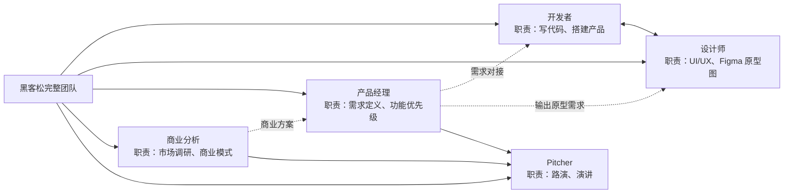
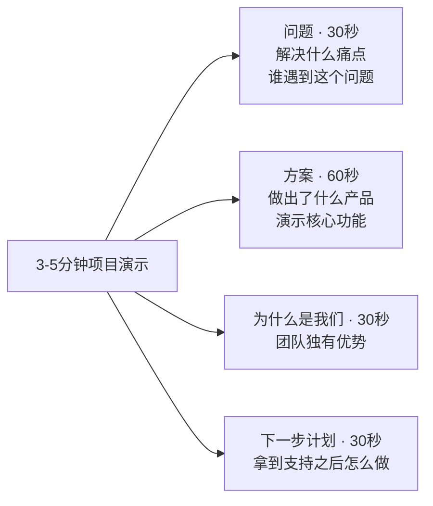

---
prev:
  text: 'github LGTM'
  link: '/github-lgtm'
next: 
  text: 'Developing'
  link: '/developing'
---

<!--
 * @Author: Skixkk skixkk7@gmail.com
 * @Date: 2026-08-19 12:26:41
 * @LastEditors: Skixkk skixkk7@gmail.com
 * @LastEditTime: 2026-08-20 14:52:18
 * @FilePath: \runsme-com.github.io\docs\hackathon\index.md
 * @Description: Complete Guide to Hackathon
-->

# 黑客松思维：团队协作与 github 开源贡献

为什么要做这个产品？想解决什么问题？
因为（消费市场、技术市场）市场的某些需求

发现需求，使用敏捷开发解决业务/技术问题

> 黑客松：完成第一个真实项目、认识创业伙伴、进入创投圈。是一场限时创造竞赛。

主要流程：`找方向、组队、开发、到路演`

## Workflow

发现真实问题、快速组队、用 AI 和开源工具做出原型，再通过路演获得反馈。

- 发现技术问题，开源 github，帮助社区/开源项目/业务场景/技术场景
- 找到伙伴：复合角色，敏捷开发，分工明确（业务、技术、readme、宣传）
- 开源到 GitHub

### roles

### 流程化

- 基于常用 [技术栈](https://runsme.com/opensource/stack.html)，选择 技术栈
- 用Claude Code / deepseek harness / 豆包可以帮你快速生成demo
- 外向 + 商业背景/投资背景的演讲人进行项目的对市场需求、技术人需求以及项目护城河的建立与演示
- 实现`基于一个需求，讲一个故事，实现一个功能，github 开源一个项目，docs一个文档，bilibili讲解视频发布` 的单流程有意义的推进。

### 启发

- 快速基于一个主要功能完成建设，休息与沉淀需求，继续 fix && feat
- 不要过于追求技术细节，具有一定的技术美学即可，比如 写 react 的时候，小功能的模块写在了 大的上面，就拆分出来，做低耦合；但是部分不复用/没必要拆分的部分，不要过于纠结

## 可迁移技能

## 在团队舒适区建立项目（开源）

- 选择解决技术人员的问题，进行开源，选择非金融题材进行开源
- 真实用户选择技术人员可以在常用的国内外平台进行教程讲解与文章发布、时间成本不高，精力需求会随着社区的需求，得到一定的可观回报，支撑你的项目走下去。
- 从建立项目之初，就写一个清晰的 README; 建立 github action CI/CD ，基于 vitepress 的 `docs/`（start &planing） deploy 到 github-pages，把代码推上 GitHub，。这是「活的简历」也是 你技术实力的展示与开源证明。

### 把故事添加进简历

- 「带领 N 人团队在 [赛事名] 中，48 小时内完成 [产品名] 的开发和上线，获得 [成绩/评委反馈]。」[github repo](https://github.com/runsme-com/runsme-com.github.io);[github docs/](https://runsme-com.github.io/docs)

### 积累技术细节与 将 pre-projects 开源到 github

- 到时候直接拉取 or copy
- 将服务器 apt nginx 配置 Django FastAPI 的配置，写成配置文件与教程/流程/脚本，直接配置好
- 比赛最重要的就是奖金与对比赛规则的积累，写成文档传给下一届，同时将 demo 拿回公司进行完善与 社区建设，对开源完整度、专业度与需求性进行一定的贡献。

## 回答

- 创业比赛通常重商业计划书和路演，黑客松更重现场做出可演示产品。对大学生来说，黑客松更像一次极速创业实验：先做出来，再用真实反馈判断方向是否值得继续。
- 答：在商业比赛中做出来 demo 即使是界面在演示中截图也是可以的（商业比赛中大部分团队没有能力做出来一个商业化/技术化的 demo/thanking），同时可以 开源到 GitHub 提升知名度。

- 任何项目最重要的就是 GitHub 开源 项目经历与项目 build 的经验 和 找到一家调性契合的公司/投资人（国内投资人大部分是签对赌协议的，这种就不建议了，类似赌博，除非条件在你实现之下，例如刘强东的回购对赌）

## 非开源

选择离钱最近的路线，
比如金融题材，量化交易、市场漏洞捕捉与利润获取等。

## ref

- [大学生参加黑客松完全指南](https://xiaoyuanvc.com/resources/hackathon-starter-guide)
