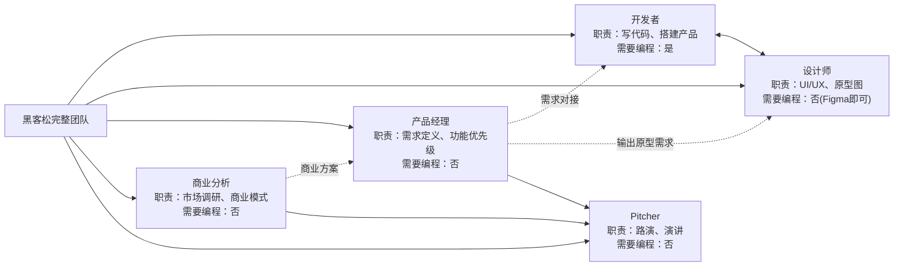

---
prev:
  text: 'github LGTM'
  link: '/github-lgtm'
next: 
  text: 'Our Team'
  link: '/our-team'
---

<!--
 * @Author: Skixkk skixkk7@gmail.com
 * @Date: 2026-08-19 12:26:41
 * @LastEditors: Skixkk skixkk7@gmail.com
 * @LastEditTime: 2026-08-19 12:29:56
 * @FilePath: \runsme-com.github.io\docs\hackathon\index.md
 * @Description: Complete Guide to Hackathon
-->

# 黑客松思维的提取

发现需求，使用敏捷开发解决业务/技术问题

> 黑客松：完成第一个真实项目、认识创业伙伴、进入创投圈。是一场限时创造竞赛。

主要流程：`找方向、组队、开发、到路演`

## Workflow

发现真实问题、快速组队、用 AI 和开源工具做出原型，再通过路演获得反馈。

- 发现技术问题，开源 github，帮助社区/开源项目/业务场景/技术场景
- 找到伙伴：复合角色，敏捷开发，分工明确（业务、技术、readme、宣传）
- 开源到 github

## roles

## ref

- [大学生参加黑客松完全指南](https://xiaoyuanvc.com/resources/hackathon-starter-guide)
